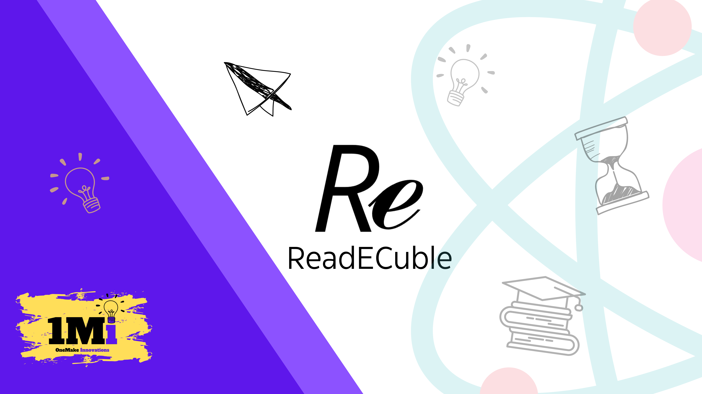

# ReadECuble
Free study materials for CSVTU: notes, PYQs, tests, videos &amp; more!

---

# Terms and Conditions
Last Updated: September 18, 2024 

Welcome to Readecuble! By using our application, you agree to comply with and be bound by the following terms and conditions. Please read these terms carefully before using our services. 

1. Acceptance of Terms 
By accessing or using the Readecuble app, you agree to these Terms and Conditions and our Privacy Policy. If you do not agree with any part of these terms, you must not use our app. 

2. Use of Content 
All notes, previous year question papers (PYQs), and other educational materials provided within the app are the property of Readecuble and are uploaded with the explicit permission of the respective owners. We have exclusive rights to distribute these materials through our platform. 

2.1 Owner's Permissions 

The materials provided in the app have been obtained from their owner's with their consent. Unauthorized distribution, reproduction, or use of these materials is strictly prohibited and it's consent must be taken from their owners prior to its distribution.

3. User Responsibility
Users are expected to use the content provided within the app solely for personal, educational purposes. Any commercial use of the content without prior written consent from Readecuble and their respective owners is prohibited. 

4. User Accounts 
To access certain features of our app, you may be required to create an account. You agree to provide accurate, current, and complete information during the registration process and to update such information to keep it accurate, current, and complete. 

   4.1 Account Security
   You are responsible for maintaining the confidentiality of your account information, including your password. You agree to notify us immediately of any unauthorized use of your account or any other breach of security. 

5. Limitation of Liability 
Readecuble is not responsible for any errors, omissions, or inaccuracies in the materials provided. We do not guarantee that the content is accurate, reliable, or complete. In no event shall Readecuble be liable for any direct, indirect, incidental, or consequential damages arising from the use of our app. 

6. Change of Terms
Readecuble reserves the right to modify these Terms and Conditions at any time. We will notify users of any changes through the app or this site. Your continued use of the app after such changes constitutes your acceptance of the new Terms and Conditions. 
---
# Privacy Policy
Last Updated: September 18, 2024

Readecuble is a resource-providing app designed specifically for students of CSVTU (Chhattisgarh Swami Vivekanand Technical University). The app offers easy access to educational materials, study resources, notes, pyq's and updates relevant to their courses, helping students manage their academic needs efficiently. It is tailored to enhance the learning experience by providing students with the tools they need to succeed in their studies. 

At Readecuble, we are committed to protecting your privacy. This Privacy Policy outlines how we collect, use, and protect your personal information when you use our app. By using Readecuble, you agree to the collection and use of your information in accordance with this policy. 

### Collecting and using Personal Data
Readecuble does not share any user data.

Readecuble collects users' names and email addresses as a means of user authentication, ensuring secure access to the app's resources and personalized features 

### Permissions We Request 
Notifications Permission: Readecuble requests permission to send notifications, allowing us to keep users informed about important updates, features, and relevant alerts related to the app. 

### Storage Access: 
Readecuble requires access to device storage to save files downloaded through the app, ensuring users can view and manage these files directly on their device. 

### Network Access: 
We require access to the internet to download necessary files, updates, and content related to the app. This also allows us to sync your data and provide real-time updates. 

### Data Security
We take appropriate security measures to protect your information against unauthorized access, alteration, disclosure, or destruction. However, no method of transmission over the internet or electronic storage is 100% secure, and we cannot guarantee its absolute security. 

### Children's Privacy:
Our application does not address any one under the age of 13. We do not collect any personnel information from children through our application.

---

# Account Deletion
At ReadECuble, we value user privacy and ensure that all user data is handled securely. Upon request, users can have their accounts and all associated data permanently deleted. No data is retained unless requested otherwise by the user. To request deletion of your account, simply follow these steps:

- Navigate to the Side Navigation -> "Account" section in the app.

- Select the "Delete Account" option.

- Confirm your request.

Upon account deletion, all information such as Name, E-mail Id, College name will be permanently erased from our servers. No data is kept, and there is no additional retention period. If you have any concerns or questions, please reach out to us via the support link provided in the app.

---
# Contact Information
If you have any questions or concerns about our Privacy Policy or how we handle your data, please contact us at:

Email: readecuble@gmail.com
